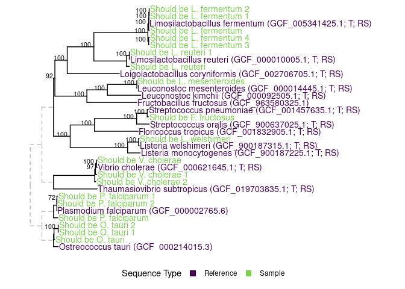
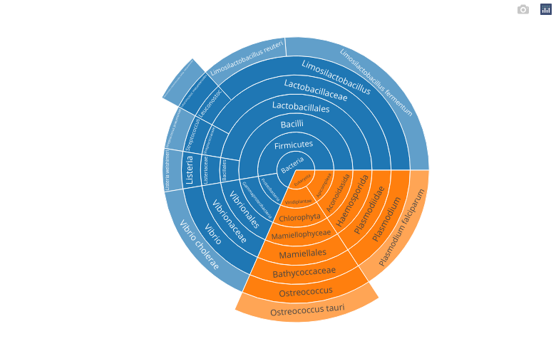

# `PathoSurveilR`: an R package for analysis of the `pathogensurveillance` pipeline

`PathoSurveilR` is an R package with functions that can read, summarize, plot,
and manipulate data produced by the pipeline
[`pathogensurveillance`](https://github.com/nf-core/pathogensurveillance).

## Installation

Although `PathoSurveilR` is not on CRAN yet, you can install the development
version from the source code on Github:

``` r
install.packages("devtools")
devtools::install_github("grunwaldlab/PathoSurveilR")
```

## Introduction

Most functions in the `PathoSurveilR` package have the same way of accepting
input. Given one or more directory paths, functions will find their
needed input in any `pathogensurveillance` output directories that are
in the given directories. For example, an output directory of
`pathogensurveillance` is included in the package and its path on your
computer can be found like so:

``` r
library(PathoSurveilR)
path <- system.file('extdata/ps_output', package = 'PathoSurveilR')
print(path)
```

    ## [1] "/home/fosterz/R/x86_64-pc-linux-gnu-library/4.4/PathoSurveilR/extdata/ps_output"

This path can then be used as the only required input for nearly every
function in `PathoSurveilR`. For example, here is how to get the multigene
phylogeny plot, which contains core gene phylogenies for prokaryotes and
busco phylogenies for eukaryotes:

``` r
multigene_tree_plot(path)[[2]]  # This function returns a list of plots, so [[2]] selects the second plot
```

<!-- -->

And here is how to get the best matches for each sample using an
estimate of ANI:

``` r
estimated_ani_match_table(path)
```

<table class="table" style="color: black; width: auto !important; margin-left: auto; margin-right: auto;">
<thead>
<tr>
<th style="text-align:left;">
Sample
</th>
<th style="text-align:left;">
Closest reference
</th>
<th style="text-align:left;">
Reference ANI (%)
</th>
<th style="text-align:left;">
Closest sample
</th>
<th style="text-align:left;">
Sample ANI (%)
</th>
</tr>
</thead>
<tbody>
<tr>
<td style="text-align:left;">
LM1
</td>
<td style="text-align:left;">
Leuconostoc mesenteroides subsp. mesenteroides ATCC 8293
</td>
<td style="text-align:left;">
0.9962
</td>
<td style="text-align:left;">
LF5
</td>
<td style="text-align:left;">
0.8109
</td>
</tr>
<tr>
<td style="text-align:left;">
OT1
</td>
<td style="text-align:left;">
GCF_000214015.3
</td>
<td style="text-align:left;">
0.9816
</td>
<td style="text-align:left;">
OT3
</td>
<td style="text-align:left;">
0.9834
</td>
</tr>
<tr>
<td style="text-align:left;">
VC2
</td>
<td style="text-align:left;">
Vibrio cholerae ATCC 14035
</td>
<td style="text-align:left;">
0.9939
</td>
<td style="text-align:left;">
VC1
</td>
<td style="text-align:left;">
0.9844
</td>
</tr>
<tr>
<td style="text-align:left;">
LR1
</td>
<td style="text-align:left;">
Limosilactobacillus reuteri subsp. reuteri JCM 1112
</td>
<td style="text-align:left;">
1.000
</td>
<td style="text-align:left;">
LR2
</td>
<td style="text-align:left;">
0.9696
</td>
</tr>
<tr>
<td style="text-align:left;">
PF3
</td>
<td style="text-align:left;">
GCF_000002765.6
</td>
<td style="text-align:left;">
0.9948
</td>
<td style="text-align:left;">
PF1
</td>
<td style="text-align:left;">
0.9899
</td>
</tr>
<tr>
<td style="text-align:left;">
LW1
</td>
<td style="text-align:left;">
Listeria welshimeri
</td>
<td style="text-align:left;">
0.9920
</td>
<td style="text-align:left;">
LR2
</td>
<td style="text-align:left;">
0
</td>
</tr>
<tr>
<td style="text-align:left;">
PF2
</td>
<td style="text-align:left;">
GCF_000002765.6
</td>
<td style="text-align:left;">
0.9856
</td>
<td style="text-align:left;">
PF3
</td>
<td style="text-align:left;">
0.9834
</td>
</tr>
<tr>
<td style="text-align:left;">
OT2
</td>
<td style="text-align:left;">
GCF_000214015.3
</td>
<td style="text-align:left;">
0.9802
</td>
<td style="text-align:left;">
OT3
</td>
<td style="text-align:left;">
0.9995
</td>
</tr>
<tr>
<td style="text-align:left;">
LF3
</td>
<td style="text-align:left;">
Limosilactobacillus fermentum
</td>
<td style="text-align:left;">
0.9805
</td>
<td style="text-align:left;">
LF2
</td>
<td style="text-align:left;">
0.9789
</td>
</tr>
<tr>
<td style="text-align:left;">
FF1
</td>
<td style="text-align:left;">
Streptococcus pneumoniae
</td>
<td style="text-align:left;">
0.9898
</td>
<td style="text-align:left;">
LF3
</td>
<td style="text-align:left;">
0.8200
</td>
</tr>
<tr>
<td style="text-align:left;">
VC3
</td>
<td style="text-align:left;">
Vibrio cholerae ATCC 14035
</td>
<td style="text-align:left;">
0.9843
</td>
<td style="text-align:left;">
VC1
</td>
<td style="text-align:left;">
0.9844
</td>
</tr>
<tr>
<td style="text-align:left;">
LF2
</td>
<td style="text-align:left;">
Limosilactobacillus fermentum
</td>
<td style="text-align:left;">
0.9923
</td>
<td style="text-align:left;">
LF1
</td>
<td style="text-align:left;">
0.9998
</td>
</tr>
<tr>
<td style="text-align:left;">
LF5
</td>
<td style="text-align:left;">
Limosilactobacillus fermentum
</td>
<td style="text-align:left;">
0.9825
</td>
<td style="text-align:left;">
LF4
</td>
<td style="text-align:left;">
0.9894
</td>
</tr>
<tr>
<td style="text-align:left;">
LF4
</td>
<td style="text-align:left;">
Limosilactobacillus fermentum
</td>
<td style="text-align:left;">
0.9816
</td>
<td style="text-align:left;">
LF5
</td>
<td style="text-align:left;">
0.9894
</td>
</tr>
<tr>
<td style="text-align:left;">
VC1
</td>
<td style="text-align:left;">
Vibrio cholerae ATCC 14035
</td>
<td style="text-align:left;">
0.9845
</td>
<td style="text-align:left;">
VC3
</td>
<td style="text-align:left;">
0.9844
</td>
</tr>
<tr>
<td style="text-align:left;">
OT3
</td>
<td style="text-align:left;">
GCF_000214015.3
</td>
<td style="text-align:left;">
0.9801
</td>
<td style="text-align:left;">
OT2
</td>
<td style="text-align:left;">
0.9995
</td>
</tr>
<tr>
<td style="text-align:left;">
PF1
</td>
<td style="text-align:left;">
GCF_000002765.6
</td>
<td style="text-align:left;">
0.9925
</td>
<td style="text-align:left;">
PF3
</td>
<td style="text-align:left;">
0.9899
</td>
</tr>
<tr>
<td style="text-align:left;">
LF1
</td>
<td style="text-align:left;">
Limosilactobacillus fermentum
</td>
<td style="text-align:left;">
0.9923
</td>
<td style="text-align:left;">
LF2
</td>
<td style="text-align:left;">
0.9998
</td>
</tr>
<tr>
<td style="text-align:left;">
LR2
</td>
<td style="text-align:left;">
Limosilactobacillus reuteri subsp. reuteri JCM 1112
</td>
<td style="text-align:left;">
0.9697
</td>
<td style="text-align:left;">
LR1
</td>
<td style="text-align:left;">
0.9696
</td>
</tr>
</tbody>
</table>

Many functions also have an option for interactive output for use in
HTML documents. Since this is a markdown document (`README.md`),
interactive plots will not work but here is a screenshot of an
interactive plot showing the taxonomic distribution of sendsketch hits:

``` r
sendsketch_taxonomy_plot(path, interactive = TRUE)
```

<!-- -->

You can also get more low level information from the pipeline results to
do custom analyses. For example, functions ending with `_path` or
`_path_data` give you the paths of various types of
`pathogensuriveillance` outputs, returning `vector`s or `tibble`s of
paths respectively:

``` r
estimated_ani_matrix_path(path)
```

    ## [1] "/home/fosterz/R/x86_64-pc-linux-gnu-library/4.4/PathoSurveilR/extdata/ps_output/sourmash_ani_matrix.csv"

``` r
core_tree_path_data(path)
```

    ## # A tibble: 2 × 3
    ##   report_group_id path                                                cluster_id
    ##   <chr>           <chr>                                               <chr>     
    ## 1 all             /home/fosterz/R/x86_64-pc-linux-gnu-library/4.4/ps… 1         
    ## 2 all             /home/fosterz/R/x86_64-pc-linux-gnu-library/4.4/ps… 2

``` r
sendsketch_path_data(path)
```

    ## # A tibble: 19 × 3
    ##   report_group_id path                                                 sample_id
    ##   <chr>           <chr>                                                <chr>    
    ## 1 all             /home/fosterz/R/x86_64-pc-linux-gnu-library/4.4/psm… FF1      
    ## 2 all             /home/fosterz/R/x86_64-pc-linux-gnu-library/4.4/psm… LF1      
    ## 3 all             /home/fosterz/R/x86_64-pc-linux-gnu-library/4.4/psm… LF2      
    ## 4 all             /home/fosterz/R/x86_64-pc-linux-gnu-library/4.4/psm… LF3      
    ## 5 all             /home/fosterz/R/x86_64-pc-linux-gnu-library/4.4/psm… LF4      
    ## # ℹ 14 more rows

You can also get parsed versions of all of these `pathogensuriveillance`
outputs using functions ending in `parsed`:

``` r
sendsketch_parsed(path)
```

    ## # A tibble: 380 × 39
    ##   sample_id report_group_id  WKID KID     ANI SSU   SSULen Complt Contam Contam2
    ##   <chr>     <chr>           <dbl> <chr> <dbl> <chr>  <dbl>  <dbl> <chr>  <chr>  
    ## 1 FF1       all              96.3 65.6…  99.9 .          0  100   3.69%  0.04%  
    ## 2 FF1       all              31.4 21.4…  95.9 .          0   76.0 47.96% 0.04%  
    ## 3 FF1       all              20.3 14.0…  94.4 .          0   67.1 53.39% 0.04%  
    ## 4 FF1       all              20.7 13.7…  94.5 .          0   61.8 58.96% 0.12%  
    ## 5 FF1       all              15   10.4…  93.4 .          0   61.2 57.56% 0.04%  
    ## # ℹ 375 more rows
    ## # ℹ 29 more variables: uContam <chr>, Score <dbl>, `E-Val` <dbl>, Depth <dbl>,
    ## #   Depth2 <dbl>, Volume <dbl>, RefHits <dbl>, Matches <dbl>, Unique <dbl>,
    ## #   Unique2 <dbl>, Unique3 <dbl>, noHit <dbl>, Length <dbl>, TaxID <dbl>,
    ## #   ImgID <dbl>, gBases <chr>, gKmers <chr>, gSize <chr>, gSeqs <dbl>,
    ## #   GC <dbl>, rDiv <dbl>, qDiv <dbl>, rSize <dbl>, qSize <dbl>, cHits <dbl>,
    ## #   taxName <chr>, file <chr>, seqName <chr>, taxonomy <chr>

``` r
core_tree_parsed(path)
```

    ## $`/home/fosterz/R/x86_64-pc-linux-gnu-library/4.4/PathoSurveilR/extdata/ps_output/core_gene_trees/all_cluster_1.treefile`
    ## 
    ## Phylogenetic tree with 5 tips and 4 internal nodes.
    ## 
    ## Tip labels:
    ##   GCF_019703835_1, GCF_000621645_1, VC2, VC3, VC1
    ## Node labels:
    ##   Root, 97, 100, 
    ## 
    ## Rooted; includes branch length(s).
    ## 
    ## $`/home/fosterz/R/x86_64-pc-linux-gnu-library/4.4/PathoSurveilR/extdata/ps_output/core_gene_trees/all_cluster_2.treefile`
    ## 
    ## Phylogenetic tree with 21 tips and 20 internal nodes.
    ## 
    ## Tip labels:
    ##   GCF_900187225_1, GCF_900187315_1, LW1, GCF_001832905_1, FF1, GCF_001457635_1, ...
    ## Node labels:
    ##   Root, 100, 100, 100, 100, 100, ...
    ## 
    ## Rooted; includes branch length(s).

Functions that use the same data always start with the same words, so if
you know what data out want to look at, you can see all the ways that
`PathoSurveilR` can interact with it by typing `PathoSurveilR::` in an IDE like
RStudio followed by the data type name and hit `<TAB>` to see
autocomplete suggestions. For example `PathoSurveilR::estimated_ani_` +
`<TAB>` will show all of these functions:

- `estimated_ani_heatmap`
- `estimated_ani_match_table`
- `estimated_ani_matrix_path`
- `estimated_ani_matrix_path_data`
- `estimated_ani_matrix_parsed`

## License

This work is subject to the [MIT
License](https://github.com/grunwaldlab/metacoder/blob/master/LICENSE).

## Credits

The following people contributed to `PathoSurveilR`: Zachary S.L. Foster,
Martha Sudermann, Camilo Parada-Rojas, Logan K. Blair, Fernanda I.
Bocardo, Ricardo Alcalá-Briseño, Jeff H. Chang, and Niklaus J. Grünwald.

## Funding

This work was supported by grants from USDA ARS (2072-22000-045-000-D)
to Niklaus J. Grünwald, USDA NIFA (2021-67021-34433; 2023-67013-39918)
to Jeff H. Chang and Niklaus J. Grünwald, as well as USDAR ARS NPDRS and
FNRI and USDA APHIS to Niklaus J. Grünwald

## Contributions and Support

We welcome suggestions, bug reports and contributions! Make and issue on
this repository to get in contact with us.
